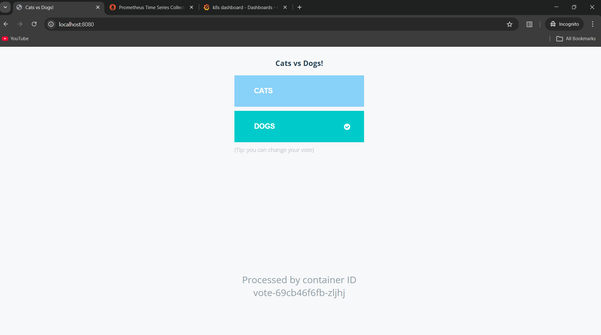
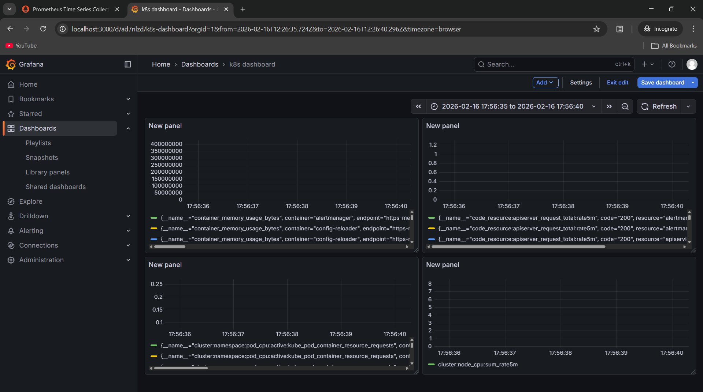
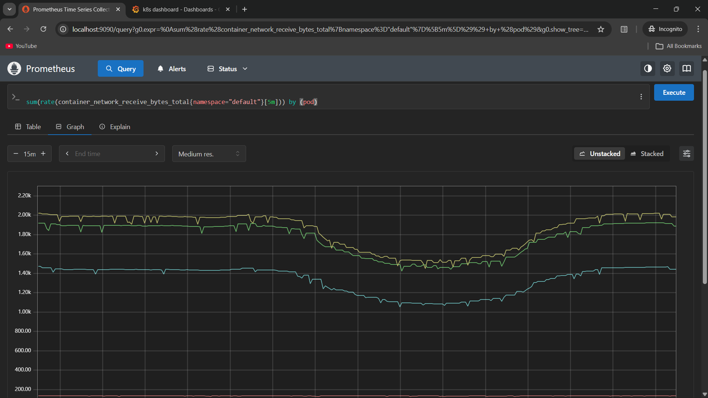

# Example Voting App (K8s Monitoring Practice)

A simple distributed application running across multiple Docker containers.

> ⚠️ This project is cloned from the official Docker sample repository:  
> https://github.com/dockersamples/example-voting-app  
>  
> This repository is used for **hands-on learning and experimentation**, specifically for:
> - Kubernetes deployments  
> - Observability & Monitoring setup  
> - Service communication analysis  
> - Infrastructure-level debugging  

---

## 🚀 Getting Started

Download [Docker Desktop](https://www.docker.com/products/docker-desktop) for Mac or Windows.  
Docker Compose will be installed automatically.  

On Linux, ensure you have the latest version of [Docker Compose](https://docs.docker.com/compose/install/).

This solution uses:

- Python (Vote frontend)
- Node.js (Result frontend)
- .NET (Worker service)
- Redis (Message broker)
- PostgreSQL (Persistent storage)

Run in this directory:

```bash
docker compose up
```
The services will be available at:

- Vote app → http://localhost:8080
- Results app → http://localhost:8081

## 📸 Screenshots

### Voting Interface


### Results Dashboard


### Grafana Monitoring


### Prometheus Targets



# Learning Objective
This repository is used to practice:
- Kubernetes resource creation (Deployments, Services, Volumes)
- Monitoring stack integration (Prometheus, Grafana)
- Container orchestration concepts
- Service-to-service communication tracing
- Stateful vs Stateless workloads
- Observability in distributed systems