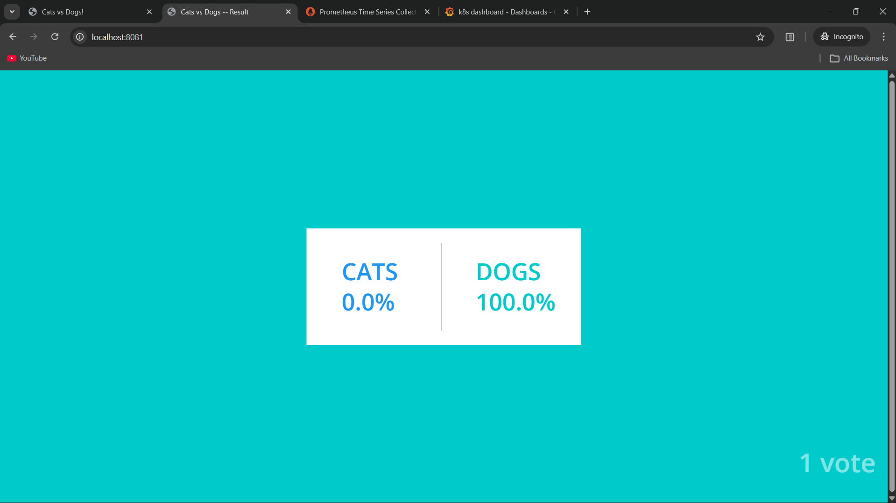
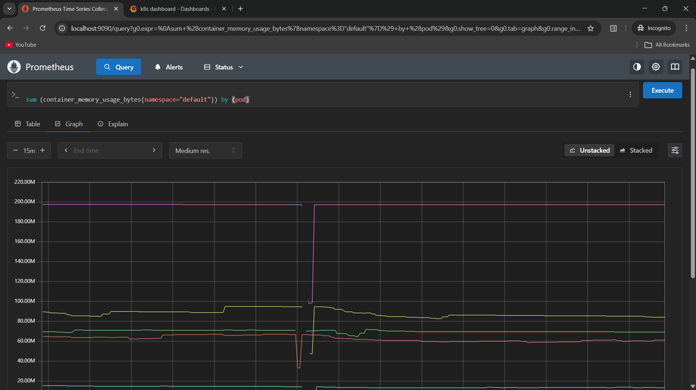

# Example Voting App (K8s Monitoring Practice)

A simple distributed application running across multiple Docker containers.

> ⚠️ This project is cloned from the official Docker sample repository:  
> https://github.com/dockersamples/example-voting-app  
>  
> This repository is used for **hands-on learning and experimentation**, specifically for:
> - Kubernetes deployments  
> - Observability & Monitoring setup  
> - Service communication analysis  
> - Infrastructure-level debugging  

---

## 🚀 Getting Started

Download [Docker Desktop](https://www.docker.com/products/docker-desktop) for Mac or Windows.  
Docker Compose will be installed automatically.  

On Linux, ensure you have the latest version of [Docker Compose](https://docs.docker.com/compose/install/).

This solution uses:

- Python (Vote frontend)
- Node.js (Result frontend)
- .NET (Worker service)
- Redis (Message broker)
- PostgreSQL (Persistent storage)

Run in to create k8s cluster and resources:

```bash
kind create cluster k8s-observe
cd k8s-specifications/
kubectl apply -f .
```

Run to check for created resources
```bash
kubectl get all
```
- This will show all created pods, serices, deployment and replicaset


Run to access the application
```bash
kubectl port-forward svc/vote 8080:8080
kubectl port-forward svc/result 8081:8081
```
The service will be available at:
- localhost:8080
- localhost:8081

Run to install prometheus and grafana
```bash
helm repo add prometheus-community https://prometheus-community.github.io/helm-charts
helm repo add stable https://charts.helm.sh/stable
helm repo update
kubectl create namespace monitoring
helm install kind-prometheus prometheus-community/kube-prometheus-stack --namespace monitoring --set prometheus.service.nodePort=30000 --set prometheus.service.type=NodePort --set grafana.service.nodePort=31000 --set grafana.service.type=NodePort --set alertmanager.service.nodePort=32000 --set alertmanager.service.type=NodePort --set prometheus-node-exporter.service.nodePort=32001 --set prometheus-node-exporter.service.type=NodePort
```

Run to check resources created in monitoring namespace
```bash
kubectl get svc -n monitoring
```

Run to access prometheus and grafana
```bash
kubectl port-forward svc/kind-prometheus-kube-prome-prometheus 9090:9090 -n monitoring
kubectl port-forward svc/kind-prometheus-grafana 3000:3000 -n monitoring
```
The service will be available at:
- localhost:9090
- localhost:3000

## 📸 Screenshots

### Voting Interface


### Results Dashboard


### Grafana Monitoring


### Prometheus Targets



# Learning Objective
This repository is used to practice:
- Kubernetes resource creation (Deployments, Services, Volumes)
- Monitoring stack integration (Prometheus, Grafana)
- Container orchestration concepts
- Service-to-service communication tracing
- Stateful vs Stateless workloads
- Observability in distributed systems